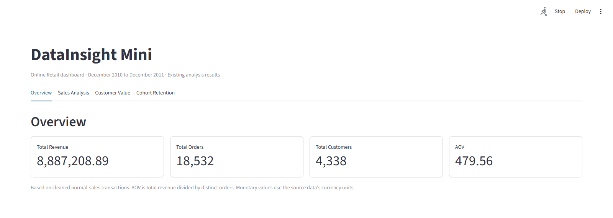
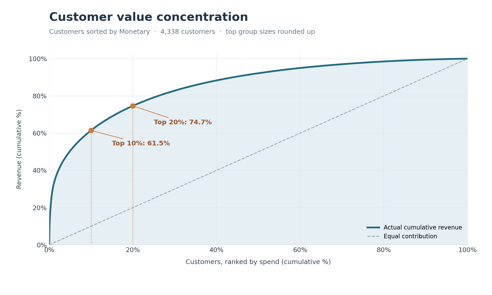
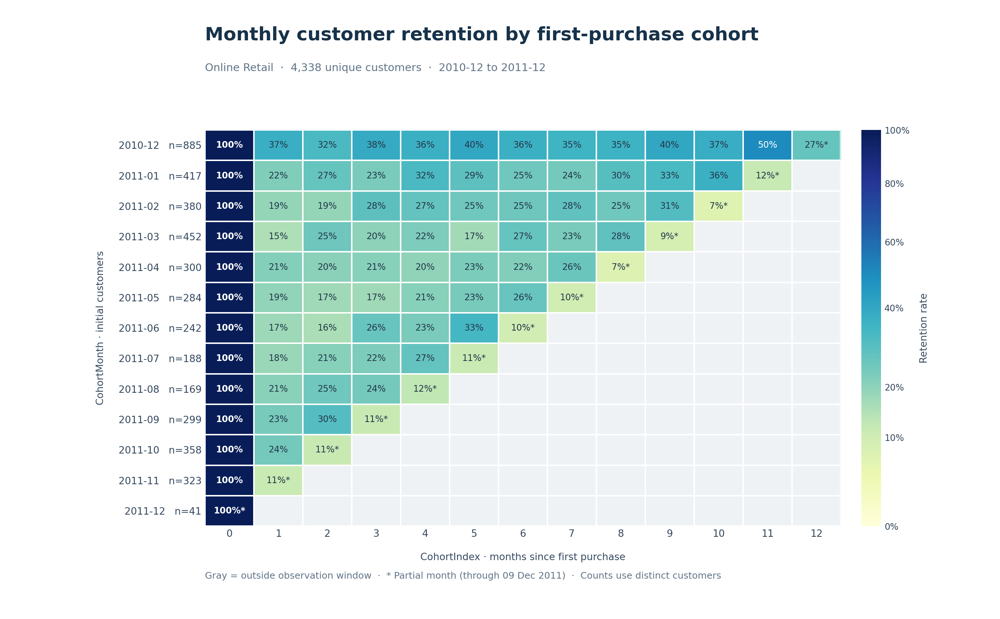

# DataInsight-Mini

基于 UCI Online Retail 真实交易数据的端到端电商业务分析项目：从数据清洗、Python 与 SQL 指标核对，到 RFM 客户分群、Cohort 留存分析和 Streamlit 可视化。

| 原始交易明细 | 清洗后有效销售明细 | Revenue | Orders | Customers |
| ---: | ---: | ---: | ---: | ---: |
| **541,909** | **392,692** | **£8.89M** | **18,532** | **4,338** |

**客户价值集中度：Top 10% 客户贡献 61.45% 销售额；Top 20% 客户贡献 74.68%。** Revenue 的精确值为 £8,887,208.894；Orders 和 Customers 分别按不同订单号与客户号去重统计。

## 项目简介

项目分析一家英国线上零售商在 2010-12-01 至 2011-12-09 的交易记录，回答销售表现、客户价值分布和首购后复购情况三个业务问题。全部指标基于同一份清洗后的正常销售明细。SQL 与 Python 独立计算核心指标并校验，Dashboard 读取已生成的结果文件展示分析结论。

## Dashboard Screenshot



## Key Business Insights

- **销售额集中于少数客户。** 按累计消费额排序，434 位 Top 10% 客户贡献 **61.45%** 销售额；868 位 Top 20% 客户贡献 **74.68%**。客户人数按比例向上取整，结果见 [客户价值集中度图](results/rfm/customer_value_concentration.png)。
- **RFM 分群呈现明显价值差异。** Champions 有 902 人，占客户的 20.79%，贡献 63.55% 销售额；Lost Customers 有 1,218 人，占客户的 28.08%，贡献 4.49% 销售额。分群是基于观察期交易行为的描述性标签。
- **2011 年 11 月是该年完整月份的销售峰值。** 当月销售额为 **£1,156,205.61**。2011 年 12 月仅记录至 9 日，不与完整月份直接比较。
- **首购次月复购仍有提升空间。** 在截至 2011 年 11 月拥有完整次月观察窗口的 Cohort 中，首购后第 1 个月的加权留存为 **23.65%**（940 / 3,974）。这里的“留存”指当月再次购买，不代表连续每月购买。

## Tech Stack

Python、pandas、NumPy、Matplotlib、SQLite（Python 内置 `sqlite3`）、SQL、Streamlit、openpyxl。Dashboard 的运行依赖见 [requirements.txt](requirements.txt)；离线重算分析结果还需 NumPy、Matplotlib 和 openpyxl。

## Project Architecture

```text
DataInsight-Mini/
├── app.py                         # Streamlit Dashboard
├── assets/
│   └── dashboard-overview.png     # Dashboard 截图
├── data/
│   ├── raw/online_retail.xlsx     # 本地原始数据，不入库
│   ├── processed/online_retail_clean.csv  # 本地清洗数据，不入库
│   └── retail.db                  # 本地 SQLite 数据库，不入库
├── src/
│   ├── clean_data.py              # 数据清洗
│   ├── analysis.py                # Python 业务指标与销售图
│   ├── sql_analysis.py            # SQLite 导入、查询与核对
│   ├── rfm_analysis.py            # RFM 分群与客户集中度
│   └── cohort_analysis.py         # Cohort 留存
├── sql/analysis.sql               # 8 条业务查询
├── results/                       # 轻量汇总、验证结果与关键图表
├── .streamlit/config.toml         # Dashboard 主题
├── .gitignore
└── requirements.txt
```

数据流：原始 Excel → `clean_data.py` → 清洗后 CSV → 四个分析脚本 → `results/` → `app.py`。各分析脚本从项目根目录运行，使用脚本所在位置定位输入和输出文件。

## Data Cleaning

原始 541,909 条记录按以下顺序清洗，得到 392,692 条正常销售明细。下表删除量是逐步筛选后的实际行数，不能把各项视为互不重叠的原始问题数。

| 步骤 | 删除行数 |
| --- | ---: |
| 完全重复的记录 | 5,268 |
| 缺失 `CustomerID` | 135,037 |
| `Quantity <= 0` | 8,872 |
| `UnitPrice <= 0` | 40 |

随后统一交易时间和客户编号类型，并计算 `Revenue = Quantity × UnitPrice`、`Year`、`Month`、`YearMonth`。项目的销售额为正常销售额，未将退货或取消记录纳入净销售额计算。

## Python Business Analysis

[`src/analysis.py`](src/analysis.py) 计算 Revenue、不同订单数、不同客户数和平均每单金额（AOV = Revenue / Orders），并绘制月度销售趋势及销售额前十的国家。结果保存为 `results/business_summary.csv`、[月度销售图](results/monthly_revenue.png) 和 [国家销售图](results/country_revenue.png)。

## SQL Analysis

[`sql/analysis.sql`](sql/analysis.sql) 包含总销售额、订单数、客户数、国家销售排名、Top 10 客户、月度销售额、客户订单汇总和 Top 10 商品编码共 8 条查询。[`src/sql_analysis.py`](src/sql_analysis.py) 将清洗明细导入本地 SQLite，执行查询并导出结果。

订单数与客户数使用 `COUNT(DISTINCT ...)`。客户平均订单金额先按客户和订单汇总，再计算均值，避免把商品明细行当作订单。[SQL 校验结果](results/sql/validation.csv) 将核心收入、订单数和客户数与 pandas 独立计算结果比较；当前数据的 **3 / 3 项校验通过**，收入只允许极小的浮点求和误差。

## RFM Customer Segmentation

[`src/rfm_analysis.py`](src/rfm_analysis.py) 为每位客户计算：

| 维度 | 定义 |
| --- | --- |
| Recency | 观察日与最后一次购买之间经过的完整天数；观察日为数据最后交易时间加 1 天 |
| Frequency | 不同 `InvoiceNo` 的数量 |
| Monetary | 正常销售明细的 `Revenue` 合计 |

三项指标各打 1～5 分；相同原始值保持同分，再按现有互斥规则分为 Champions、Loyal Customers、Potential Loyalists、New Customers、At Risk、Lost Customers 和 Other。Top 10% / 20% 按 Monetary 排序计算，人数向上取整。结果见 [分群汇总](results/rfm/segment_summary.csv)、[客户价值集中度图](results/rfm/customer_value_concentration.png) 和 [验证记录](results/rfm/validation.csv)；当前 **13 / 13 项校验通过**。



## Cohort Retention

[`src/cohort_analysis.py`](src/cohort_analysis.py) 将客户在**观察期内的首次购买月**作为 CohortMonth。每个 CohortIndex 的留存率为“该月有购买的不同客户数 / 该 Cohort 首月客户数”。这是一项月度购买指标，客户中途未购买、之后再次购买时，留存率可以回升。

未来尚未进入观察窗口的月份留空，已观察却无人购买的月份记为 0。热力图用 `*` 标出仅覆盖至 2011-12-09 的不完整月份。当前 [留存验证记录](results/cohort/validation.csv) 为 **11 / 11 项通过**。



## Dashboard

[`app.py`](app.py) 提供四个页面：Overview 展示核心 KPI；Sales Analysis 展示月度与国家销售图；Customer Value 展示 RFM 分群和头部客户贡献；Cohort Retention 展示留存热力图。页面读取已保存的 `results/` 文件，不在打开页面时重新计算指标。

## How to Run

已验证的运行环境为 Python 3.11。只查看 Dashboard 时，在项目根目录安装 `requirements.txt` 并运行最后一条命令。如需从原始数据完整复现，还需从下方数据源下载 `Online Retail.xlsx`，创建 `data/raw/` 目录并保存为 `data/raw/online_retail.xlsx`，再安装离线分析依赖并执行分析脚本：

```bash
python -m pip install -r requirements.txt
python -m pip install "numpy>=1.26,<3.0" "matplotlib>=3.8,<4.0" "openpyxl>=3.1,<4.0"  # 仅完整复现需要
python src/clean_data.py
python src/analysis.py
python src/sql_analysis.py
python src/rfm_analysis.py
python src/cohort_analysis.py
streamlit run app.py
```

仓库保留了 Dashboard 所需的轻量结果文件；只想查看现有页面时，安装依赖后可直接运行最后一条命令。完整复现会在本地重新生成结果、SQLite 数据库及逐客户明细文件。

## Dataset

数据来自 [UCI Machine Learning Repository — Online Retail](https://archive.ics.uci.edu/dataset/352/online%2Bretail)，包含 2010-12-01 至 2011-12-09 的 541,909 条英国非实体零售商交易明细。UCI 将单价单位标为英镑（sterling），本项目金额因此以 £ 展示。

引用：Chen, D. (2015). *Online Retail* [Dataset]. UCI Machine Learning Repository. [DOI: 10.24432/C5BW33](https://doi.org/10.24432/C5BW33)。数据许可为 [CC BY 4.0](https://creativecommons.org/licenses/by/4.0/)。

原始 Excel、清洗后 CSV 和 SQLite 数据库体积较大，均未纳入仓库；请按上面的说明从 UCI 获取原始文件。

## Limitations

- 分析仅覆盖清洗后、带客户编号且数量和单价均为正的正常销售记录；销售额不代表包含退货的净收入。
- 数据始于 2010 年 12 月，无法确认观察窗内的首购是否为客户真正的首次购买；`New Customers`、`At Risk` 等标签不能直接等同于注册或实际流失状态。
- 2011 年 12 月仅覆盖至 9 日；月度销售和该月留存不可与完整月份直接比较。不同 CohortIndex 可观察到的 Cohort 范围也不同。
- 结果是历史交易的描述性分析，不能单独证明营销活动或客户行为变化的因果原因。
