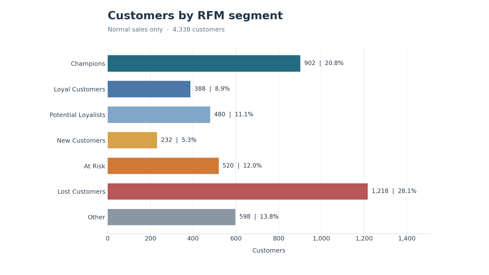
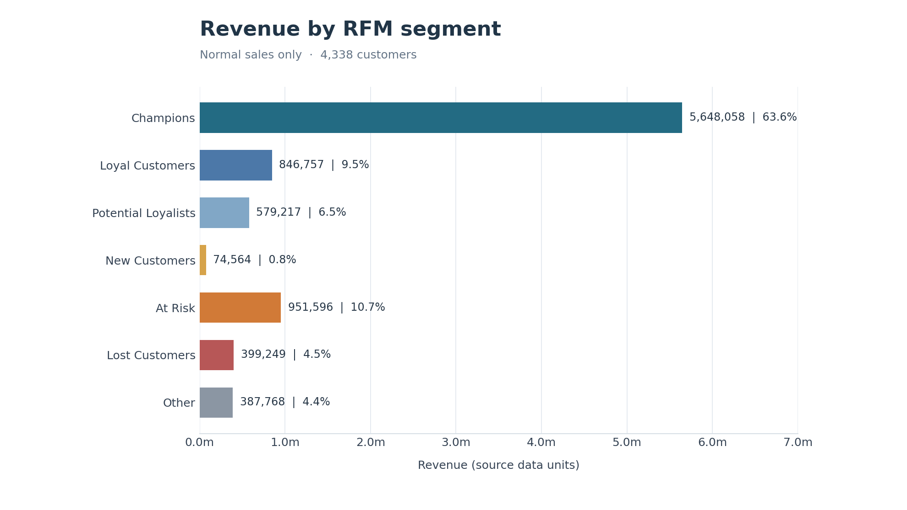

# DataInsight-Mini

一个基于 UCI Online Retail 数据集的电商交易数据分析作品集项目。

当前已完成四个阶段：数据清洗、Python 基础业务分析、SQLite 业务分析、RFM 客户价值分析。

## 数据来源

- 数据集：[UCI Machine Learning Repository - Online Retail](https://archive.ics.uci.edu/dataset/352/online+retail)
- 原始文件位置：`data/raw/online_retail.xlsx`
- 清洗结果位置：`data/processed/online_retail_clean.csv`

原始数据包含 2010 年 12 月至 2011 年 12 月期间的一家英国非实体零售商交易记录。
引用：Chen, D. (2015). *Online Retail* [Dataset]. UCI Machine Learning Repository. DOI: 10.24432/C5BW33（CC BY 4.0）。

## 运行方法

在项目根目录依次运行：

```bash
python -m pip install -r requirements.txt
python src/clean_data.py
python src/analysis.py
python src/sql_analysis.py
python src/rfm_analysis.py
```

清洗脚本会自动创建 `data/processed` 目录，并在控制台输出原始数据概况、每一步清洗删除的行数和清洗后的复核结果。
已有清洗后 CSV 时，可直接运行任一分析脚本；RFM 阶段只依赖 `data/processed/online_retail_clean.csv`，不需要先创建 SQLite 数据库。

Python 分析会生成 `results/business_summary.csv`、国家销售额图和月度销售趋势图。

## 当前清洗规则

1. 删除完全重复的数据。
2. 删除 `CustomerID` 缺失的记录。
3. 剔除 `Quantity <= 0` 的退货、取消或异常记录。
4. 剔除 `UnitPrice <= 0` 的异常记录。
5. 将 `InvoiceDate` 转为日期时间类型，将 `CustomerID` 转为字符串类型。
6. 新建 `Revenue`、`Year`、`Month` 和 `YearMonth` 字段。

## 第三阶段：SQLite 业务分析

运行 `python src/sql_analysis.py`：

1. 用 Python 内置 `sqlite3` 创建 `data/retail.db`，导入 `transactions` 表。
2. 执行 `sql/analysis.sql` 中的 8 条查询，打印结果预览。
3. 从 CSV 用 pandas 独立计算核心 KPI，与 SQL 核对。
4. 将每条查询的完整结果保存到 `results/sql/`，核对记录保存为 `validation.csv`。

不需要另外安装 SQLite 库或数据库服务。重复运行会在事务中刷新 `transactions` 表，避免重复导入；该数据库中的其他表不会被删除。编号保存为 `TEXT`，日期保存为 ISO 格式 `TEXT`，金额保存为 `REAL`。

| 查询 / 输出文件 | 回答的业务问题 |
| --- | --- |
| `total_revenue.csv` | 总销售额是多少？ |
| `total_orders.csv` | 有多少张不同订单？ |
| `total_customers.csv` | 有多少位不同客户？ |
| `country_revenue.csv` | 全部国家的销售额及排名如何？ |
| `top_customers.csv` | 消费金额最高的 10 位客户是谁？ |
| `monthly_revenue.csv` | 每个月的销售额是多少？ |
| `customer_order_summary.csv` | 每位客户的订单次数、总消费金额、平均订单金额是多少？ |
| `top_products.csv` | 累计销售额最高的 10 个商品编码是什么？ |

### 统计口径

- 沿用清洗后的正常销售口径，不含已在清洗阶段剔除的记录。
- 订单、客户分别使用 `COUNT(DISTINCT InvoiceNo)`、`COUNT(DISTINCT CustomerID)`。
- 客户平均订单金额使用 CTE 先汇总每张订单，再对订单金额求 `AVG()`。不能直接对商品明细的 `Revenue` 求平均。
- 商品按 `StockCode` 汇总；`MIN(Description)` 只是可重复选取的代表名称，不是最新名称。不额外排除源数据中的邮费等非实物编码。
- 国家查询用 `RANK()` 标注名次，销售额相同则并列。Top 10 查询以编号作为并列时的次要排序键。
- 月份按 `YYYY-MM` 排序。当前数据截至 2011-12-09，2011-12 不完整，不能直接与完整月比较。
- 计算和 CSV 导出不提前舍入，终端金额显示两位小数。核对时订单数、客户数必须精确相等；收入记录原始绝对差，并仅允许 `1e-7` 以内的浮点求和误差（远小于数据的 `0.001` 金额精度）。

### 当前数据的运行验证

- 已导入 392,692 行，8 条 SQL 均已实际执行，并逐项与独立 pandas 计算核对，包括全部 4,338 位客户的订单次数、总消费及订单均价。
- 总销售额：pandas 为 `8887208.894000001`，SQLite 为 `8887208.894`，差额为 `1.862645149230957e-09`。独立使用 Python `math.fsum` 得到 `8887208.894`，与 SQLite 精确相等，确认差异来自浮点求和。按源数据的三位小数精度，两者均为 `8887208.894`。
- 总订单数 18,532、总客户数 4,338，Python 与 SQL 精确相等。
- 已核对第二阶段 `results/business_summary.csv`，结果口径一致。
- 从项目外目录再次运行，数据库仍为 392,692 行，9 个结果 CSV 内容不变，数据库完整性检查通过。
- 另用内存数据库验证不等长订单均价、并列国家排名、多描述商品、重复导入和插入失败回滚。

## 第四阶段：RFM 客户价值分析

运行 `python src/rfm_analysis.py`。分析对象是清洗后的正常销售记录：392,692 行、4,338 位客户；不包含退货、取消交易、无客户编号或非正价格的记录。数据中的最后交易时间为 `2011-12-09 12:50:00`，因此 `reference_date = max(InvoiceDate) + 1 天 = 2011-12-10 12:50:00`。这个观察点晚于全部交易，最新一笔交易的 Recency 为 1，而不会出现 0；它由数据确定，重复运行结果一致。

### 指标与打分

| 指标 | 每位客户的计算方法 | 高价值方向 |
| --- | --- | --- |
| Recency (R) | `reference_date - 最后一次购买时间` 的完整天数（`.dt.days`） | 越小越好 |
| Frequency (F) | 不同 `InvoiceNo` 的数量，即 `COUNT(DISTINCT InvoiceNo)`，不是商品明细行数 | 越大越好 |
| Monetary (M) | 所有正常销售记录的 `Revenue` 之和 | 越大越好 |

R、F、M 各取 1～5 分，5 分代表该维度更高价值。先对 4,338 位客户按指标排名：R 从大到小，F/M 从小到大。相同原始值使用并列组的最低名次（`rank(method="min")`），所以相同指标一定同分。百分位位置为 `(名次 - 1) / (客户数 - 1)`；分数为 `min(5, floor(百分位位置 × 5) + 1)`。若某项指标所有客户完全相同，则该项统一给中性 3 分。`RFM_Score` 将三项分数字符串拼接，例如 `555`。

F 有大量相同值，其中 1 单客户 1,493 人。直接对原值使用 `qcut(..., 5)` 会遇到重复边界；本脚本使用上述保留并列值的百分位排名，不改动原数据，也不强求每档恰好 20% 的客户。由于 R 保留时分秒再取完整天数，Recency 是经过的完整 24 小时数，不等同于自然日日期差。

### 客户分群规则

分群只使用上述 R/F/M 分数。条件互斥，每位客户恰好归入一类；未命中前六类的客户属于 Other。

| 客户群 | 明确规则 | 含义 |
| --- | --- | --- |
| Champions | `R >= 4` 且 `F >= 4` 且 `M >= 4` | 近期活跃、复购和消费金额都高 |
| Loyal Customers | `R >= 3` 且 `F >= 4`，但不属于 Champions | 购买频繁，近期仍有活动 |
| Potential Loyalists | `R >= 4` 且 `F` 为 2～3 | 最近购买并已有一定复购 |
| New Customers | `R >= 4` 且 `F = 1` | 最近购买且观察期内只有一单 |
| At Risk | `R <= 2` 且（`F >= 3` 或 `M >= 4`） | 过去有频率或金额价值，但已久未购买 |
| Lost Customers | `R <= 2` 且 `F <= 2` 且 `M <= 3` | 已久未购买，历史购买较少且金额较低 |
| Other | 其余组合 | 中等活跃但尚不符合以上规则 |

`New Customers` 仅代表此数据观察期内近期且仅一单的客户；数据没有注册日期，不能证明他们刚注册。`At Risk` 和 `Lost Customers` 是相对于本数据快照的观察标签，并不证明客户实际流失。

### 当前数据结果

客户占比以 4,338 位客户为分母，销售额占比以正常销售总额 `8,887,208.894` 为分母。平均消费金额是该群总销售额除以群内客户数。表格仅为显示而四舍五入，CSV 保留计算精度。

| 客户群 | 客户数 | 客户占比 | 总销售额 | 销售额占比 | 人均消费金额 |
| --- | ---: | ---: | ---: | ---: | ---: |
| Champions | 902 | 20.79% | 5,648,057.89 | 63.55% | 6,261.70 |
| Loyal Customers | 388 | 8.94% | 846,757.42 | 9.53% | 2,182.36 |
| Potential Loyalists | 480 | 11.07% | 579,216.93 | 6.52% | 1,206.70 |
| New Customers | 232 | 5.35% | 74,563.78 | 0.84% | 321.40 |
| At Risk | 520 | 11.99% | 951,595.90 | 10.71% | 1,829.99 |
| Lost Customers | 1,218 | 28.08% | 399,249.07 | 4.49% | 327.79 |
| Other | 598 | 13.79% | 387,767.90 | 4.36% | 648.44 |

按 Monetary 从高到低排序，Top 10% 的人数向上取整为 434 人，贡献 `5,461,374.89`，占销售额 **61.45%**；Top 20% 为 868 人，贡献 `6,637,300.821`，占 **74.68%**。并列金额按 CustomerID 排序以保证可重复；客户数向上取整使实际客户占比分别约为 10.00% 和 20.01%。

### 输出与验证

| 文件 | 内容 |
| --- | --- |
| `results/rfm/rfm_customers.csv` | 每位客户的 R/F/M 原始指标、最后购买时间、三个分数、`RFM_Score` 和客户群 |
| `results/rfm/segment_summary.csv` | 七个客户群的客户数、两类占比、总销售额和人均消费金额 |
| `results/rfm/top_customer_contribution.csv` | Top 10% 与 Top 20% 客户的精确人数和销售额贡献 |
| `results/rfm/validation.csv` | 13 项核对的实际值、期望值及通过状态 |
| `results/rfm/customer_segments.png` | 各群客户人数 |
| `results/rfm/segment_revenue.png` | 各群销售额 |
| `results/rfm/customer_value_concentration.png` | 累计客户占比与累计销售额 |

验证包括：RFM 客户数为 4,338；客户编号与源数据一一对应；Monetary 合计与源 CSV 销售额一致；用客户与订单号去重后重新计数，复核 Frequency 确实为不同订单数；每位客户且只属于一个分群，且实际标签符合规则；分数范围与 `RFM_Score` 拼接正确；分群人数、销售额分别回总。金额在 CSV 中不提前舍入，汇总比较允许不超过 `1e-7` 的浮点求和误差。当前数据 13 项验证全部通过。






本项目当前范围止于 RFM 客户价值分析，不包含 Cohort、机器学习或 Dashboard。
